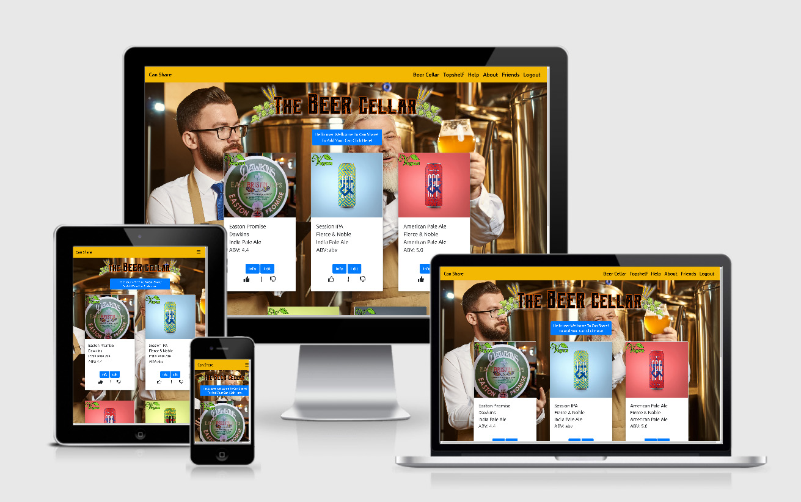

<h1 align="center">
   
 </h1>
 

    
[View  in GitHub Pages](https://github.com/jonathanw82/Can_Share)

Can share was spurned out of a love for beer with good friends, where once a month we would meet up at our local brewery, bring a can each of whatever style of beer, 
all have a sample each and give our opinions on taste, smell, mouth feel/ body, colour, can or bottle design and how the can/bottle feels in the touch. Is it a 
quality beer in a shoddy can or a shoddy beer in a quality can then after trying a few we do an overall rating of the beer we have sampled.

The site is directed at Beer lovers and hobbyists rather than businesses.

#### Temporary logins for evaluation
* Admin = Username: admin, Email: admin@test.com, Passw: admin
Deletion of beers is only possible through Admin.
* User = Username: user, Email: user@test.com, Passw: user

#### The users goals of this website are:
* Rate beers and create, update, and delete beers.
* Clearly displaying Can logo art and credentials.
* Easy to navigate. 

#### The Business potentials of this website are:
* Selling advertising space to businesses with beer related products.
* Become an ecommerce site selling the rated products.

#### Visitors to this website are searching for:
* Their favorite beers.
* Ideas of what to try next Or what to avoid.
* Where to buy the products others have tried.

#### This Website is the best way to help them achieve these things because:
* Other websites are too cluttered and hard to navigate.
* The user is able to create a login.
* The user can create, update, delete and edit their own cans or bottles.
* The user can rate other can that they may have had in the past.
* Other websites fail to have infomation of places to purchase the product.

#### This website is:
* Uncluttered and has an intuitive process to add edit and view beers.
* Providing clear artwork and and details of each can.

## Features:
* All pages have a navigation bar across the top with with links to home, help, about, and friends login, however if you are loggedin the login turns to logout and topshelf is accessible.
* The landing page has a call to action button to add a beer, Create.
* The beer cellar displays the content of the database, Read.
* The display cards have an edit button to edit the contents, Update
* The admin login beer cellar page has the delete button, Delete
 

#### Home
The landing page fist has a warning box popup with 2 call to action buttons one 
will clear the message the other will redirect you back to google. After popup close, navigation across the top,
in the middel of the screen is a welcome message and canshare logo and a login box, the login box also has a link to the signup page and a call to action login button. If the sign up 
button is pressed, you are greeted with the sign up page all features are the same as landing page though the signup form center screen has 3 inputs username, email, password and 2 call to action
buttons sign up and back both takes you to the loginpage, after signing up you will be redirected to the login page, once logged in you are met with the the main beer cellar dashboard.

#### Beer Cellar
The beer cellar has navigation across the top, logo centertop call to action button for adding you own beers and cards with pre added cans each card has image top vegan or not 
vegan image overlay on top of card, beer name, brand beer type and abv, on the lower section there is 2 call to action buttons info and edit each take you to respective places, 
two thumbs up and down allow the user to rate there beers as they go.
The administator in the only person that can delete cards as a third button will appear with delete button if logged in Admin.

#### Add Beer 
Once the add you can button is pressed you are taken to Brew your own page, navigation var across the top with a form center with inputs, beer name, brand hops variety, mals, where can i buy it image url input and a link to the help page that opens in a separate 
browser tab and tell us about it text area, the form also contains 3 dropdown menus with types of beer, abv and average price also a switch style checkbox for whether or not its vegan with a link to the help age that opens in a sparete browser tab, followed by 2 call to 
action buttons submit and cancel. On clicking add the can is added to the database and you are redircted to beer cellar, cancel will also redirect to beer cellar but without submitting the form.

#### Edit beer
Edit beer is the same as the add beer page however the fields contain the previous selections for the orinially added items. Two call to action buttons done and cancel, done updates the databse and cancel redirects
you back to the beer cellar dashboard.

#### Info 
The info page contain the image of the product to the left and respective data about the particular product to the right a bit about the product below, with a call to action buton below that takes you back to the beer cellar.

#### TopShelf
Navigation across the top, logo center top and the highest rated can card diaplayed in the middle.

#### Help
Navigation across the top, heading middle top and infomation below about how to add a can, is my beer vegan, how to edit a can, how to add a link to images and urls for mobile and desktop.
The page also has links to wikapedia on different types of beer. Followed by links to self help such as drink aware and alcoholics anonymous. 
The help page is linked to, throughout the site, not just by the navigation bar but through small links next to things, the user may need guidance with.

#### About
A little of history of the can share and how it came about and why the website was created in the first place.

#### Friends
Links to producers of great craft beer.

### Nice to have: 
These features may be included in future releases of this application.
* A dashboard for admin to create and edit new collections for database manipulation. 
* Admin able to add other users as admin.
* A search feature to users can select what type of beers they see.
* A chat forum so user can discuss their beers online. 

### Technology’s used will include:
[HTML5](https://en.wikipedia.org/wiki/HTML5), [CSS3](https://en.wikipedia.org/wiki/Cascading_Style_Sheets), [Bootstrap](https://getbootstrap.com/), [Javascript](https://en.wikipedia.org/wiki/JavaScript), [Python3](https://www.python.org/),  [Gitpod](https://www.gitpod.io/), [Sublime text](https://www.sublimetext.com/), [Balsamiq Mockup 3](https://balsamiq.com/wireframes/desktop/), [Adobe Photoshop](https://www.adobe.com/uk/products/photoshop.html?gclid=EAIaIQobChMIzNru2Myo6AIVF-DtCh28Fgn0EAAYASAAEgKkdvD_BwE&sdid=88X75SKR&mv=search&ef_id=EAIaIQobChMIzNru2Myo6AIVF-DtCh28Fgn0EAAYASAAEgKkdvD_BwE:G:s&s_kwcid=AL!3085!3!394411736356!e!!g!!photoshop)
[MongoDB](https://www.mongodb.com/), [Flask](https://flask.palletsprojects.com/en/1.1.x/) and [Heroku](https://www.heroku.com/).

## WireFrame Mockups:
#### Desktop View:
- [Home](https://i.imgur.com/WtK7ubc.png)).
- [Create a can](https://i.imgur.com/CYKJ2YR.png).
- [Friends](https://i.imgur.com/kkkYqu0.png).
- [TopShelf](https://i.imgur.com/FI2yR3g.png).
- [Help](https://i.imgur.com/H9QUmwu.png).
- [login](https://i.imgur.com/2lFuaEw.png).

#### Mobile & Tablet View:
- [Mobile Login](https://i.imgur.com/CRCXJ7m.png).
- [Mobile Help](https://i.imgur.com/hzh4Z1Q.png).
- [Mobile Hall of fame](https://i.imgur.com/DT1YVht.png).
- [Mobile Beer cellar](https://i.imgur.com/K4mbGn8.png).
- [Tablet Beer Cellar](https://i.imgur.com/JZEJ3YQ.png).
- [Tablet Hall of fame](https://i.imgur.com/eEr3TFK.png).
- [Tablet About and Friends](https://i.imgur.com/eex7L8X.png).
- [Tablet Login](https://i.imgur.com/bDlffe9.png).

## Screen Shots:
#### Mobile & Tablet View:
- [Desktop](https://i.imgur.com/cUgNWyf.jpg).
- [Desktop](https://i.imgur.com/4skORkj.jpg).
- [Desktop](https://i.imgur.com/zvLVQAT.jpg).
- [Desktop](https://i.imgur.com/HVTbb7w.jpg)
- [Mobile](https://i.imgur.com/lR4x7FG.jpg).
- [Tablet](https://i.imgur.com/gzAaR95.jpg).
- [Tablet](https://i.imgur.com/O0gizPP.jpg).

#### Database MongoDB Atlas:
MongoDB was used for this project and PyMongo is used to interact with the database.

The database has a four collections named 'cansAndBottleInfo', 'ratings', type, and users.

- [DataBase relation](https://i.imgur.com/hcFdVr7.jpg).
- [Beer Types Database](https://i.imgur.com/eUZQwb7.jpg).
- [User Database](https://i.imgur.com/9Vmh7kp.jpg).
- [Cans and bottle Database](https://i.imgur.com/gqnn0ii.jpg).
- [Can Rating Database](https://i.imgur.com/t3GFAW9.jpg).
 
## cansAndBottleInfo

| Field         | Type     | Description                                |
| :------------ | :------- | :----------------------------------------- |
| \_id          | ObjectId | ID is auto-created by MongoDB              |
| name          | String   | Name of beer                               |
| brand         | String   | Brand of beer                              |
| beer_type     | ObjectId | Id of beer Type                            |
| abv           | String   | Alchohol by volume number                  |
| vegan         | Boolean  | Is beer vegan                              |
| Hop_type      | String   | Types of hops                              |
| malts         | String   | Types of Malts used                        |
| average_price | String   | Types of hops                              |
| where_bought  | String   | Where the product is sold                  |
| image_url     | String   | link to image                              |
| review        | String   | Info about the beer                        |
| creator       | String   | Email of the user who added it             | 

I chose the fields above for simplicity so it was not difficult to fill out the form to add a beer all
fields are required except thing the user may not know, such as hops_type, malts  and whether the drink is vegan.
Most of the other fields are easily found on the product can or bottle.

## type

| Field         | Type     | Description                                |
| :------------ | :------- | :----------------------------------------- |
| \_id          | ObjectId | ID is auto-created by MongoDB              |
| type          | String   | type of beer (EG stout, red, sour etc)     |

I decided to keep the beer type in a separate collection, using the type id as the cansAndBottleInfo collection 
type of beer, that way if an IPA ever changed its name, it would be easier to change the name in one collection 
and all with that id will automatically be changed. 

## ratings

| Field         | Type     | Description                                |
| :------------ | :------- | :----------------------------------------- |
| \_id          | ObjectId | ID is auto-created by MongoDB              |
| userId        | String   | User email                                 |
| canId         | String   | Id of the can                              |
| rating        | String   | Either 1 or zero                           |

The userId is based on the session email, the canId the cansAndBottleInfo id and the rating keeping this separte from the 
cansAndBottleInfo was my decision in case i felt the feature was not working it could easly be removed 
protecting the core cansAndBottleInfo collection.

## users

| Field         | Type     | Description                                |
| :------------ | :------- | :----------------------------------------- |
| \_id          | ObjectId | ID is auto-created by MongoDB              |
| username      | String   | Name of user                               |
| email         | String   | Email address of user                      |
| password      | String   | Encrypted password of the user             |
| type          | String   | Type of user (EG user or admin)            |

I felt the login needed to be sa simple as possible hence keeping to only three bits of user data thay can add. 
The user type is added automatically behind the scenes.

## Defensive Design
 A main concern I had during development, was that any user could delete a can added by another user or spam the database.

For this version of the application I have a restriction that only the person logged in as admin can delete posts, while users can add and edit any post.

In future releases of the application I will put restriction so that the only user that can delete or edit a product is the user that created it, therefore stopping any malicious activity.

Currently the application only uses frontend data validation via the form field attributes (maximum of 300 characters in text areas, only accepting valid url, etc.).
This will limit the amount of data a user can enter, but a user could enter offensive text.

Eventually I intend to use backend data validation and possibly have posts be checked by an administrator before being added to the database. 

## Testing:
**Test:** Age warning modal pops up, button under 18? redirects current brower tab to google, Enter site clears modal so user as access to login.

**Result:** No errors, works as intended.

**Test:** Signup link on loginbox redirects to signup page

**Result:** No errors, works as intended.

**Test:** Signup error checking, if the user tryes to signup again with the same email a message will tell the user they are already signed up 

**Result:** No errors, works as intended.

**Test:** Password error checking, if user puts incorrect email or password a message lets them know

**Result:** No errors, works as intended.

**Test:** login as administator gives the user the delete buttons on beer cards

**Result:** No errors, works as intended.

**Test:** login as a standard user

**Result:** No errors, works as intended.

**Test:** Add beer button takes user to add beer form, all fields, dropdowns and checkboxes that are required give feedback if incorrectly filled out, text areas are limited to 300 characters and links to help page open in separate browser windows.
 All buttons add adds the can to database and redirects to beer cellar, cancel takes user back to beer cellar.

**Result:** If the user addes a bad image url an alterantive image is selected using onerror="this.onerror=null;this.src='/static/images/noimage.jpg this works but generates a 404 error in the console, im future releases 
of Can Share I will consider having a way the user can upload images to avoid this problem other than that this page works as intended.

**Test:** Edit beer button takes user to edit beer page all fields dropdowns and checkboxes are predefined as per previouse entrys, links to help page open in separate browser windows.
 All buttons done updates the can data to database and redirects to beer cellar, cancel takes user back to beer cellar.

**Result:** No errors, works as intended.

**Test:** Info button takes user to the respective product that is selected, image and infomation is displayed, back button redirects to beer cellar.

**Result:** No errors, works as intended.

**Test:** If when added the product is vegan if checked the vegan icon is green ontop of image on card, if unchecked it has a cross in the middle of the vegan icon.

**Result:** No errors, works as intended.

**Test:** Links on navigation bar, Can Share top left onclick takes user to the beer cellar page, from all pages or if not logged in back to the login box.

**Result:** No errors, works as intended.

**Test:** All other links on navigation bar take the user to the respective pages.

**Result:** No errors, works as intended.

**Test:** Links on help page all working and redirect to new browser tabs.

**Result:** No errors, works as intended.

**Test:** Links on friends page all working and redirect to new browser tabs.

**Result:** No errors, works as intended.

**Test:** Logout takes user to the login page.

**Result:** No errors, works as intended.

### Validation and pep8
| Page                      | Result   | Any Errors                                     |
| :------------             | :------- | :--------------------------------------------- |
| CSS                       | Pass     | No Errors                                      |
| beerceller                | Pass     | No Errors                                      |
| beercellar_loggedin_admin | Fail     |     duplicate erros                            |
| beercellar_loggedin       | Fail       |                                        |
| base                      | Pass     |  No Errors                                     |
| caninfo                   | Pass     |  No Errors                                     |
| addnewbeer                | Pass     |  One Error for label did not have maching id   |
| editbeer                  | Pass     |  No Errors                                     |
| friends                   | Pass     |  No Errors                                     |
| about                     | Pass     |  No Errors                                     |
| help                      | Pass     |  No Errors                                     |
| topshelf                  | Pass     |  One Error missing end target                  |
| register                  | Pass     |  No Errors                                     |
| logedinalready            | Pass     |  One Error missing class atribute              |
| loginerror                | Pass     |  One Error missing class atribute              |
| index.js                  | Pass     |  No Errors                                     |
| onload.js                 | Pass     |  Missing semicolon                             |

### Cross Browser Compatibility
Tested on four Browsers
* Chrome    Works as intended.
* Edge      
* Opera
* Firefox

### Deployment:
To deploy this page to GitHub Pages from its GitHub repository, the following steps were taken:

Log into GitHub.
From the list of repositories on the screen, select mtfavoritetune.
From the menu items near the top of the page, select Settings.
Scroll down to the GitHub Pages section.
Under Source click the drop-down menu labelled None and select Master Branch
On selecting Master Branch the page is automatically refreshed, the website is now deployed.
Scroll back down to the GitHub Pages section to retrieve the link to the deployed website.

How to run this project locally
to clone this project from GitHub:

Follow this link to the Project GitHub repository.
Under the repository name, click "Clone or download".
In the Clone with HTTPs section, copy the clone URL for the repository.
In your local IDE open Git Bash.
Change the current working directory to the location where you want the cloned directory to be made.
Type git clone, and then paste the URL you copied in Step 3.
git clone "https://github.com/USERNAME/REPOSITORY"
Press Enter. Your local clone will be created.
Further reading and troubleshooting on cloning a repository from GitHub here.

Forking the repository.
If you would like to take a copy of this repository in its current state, this can be done by forking.
From the list of repositories on the screen, select mtfavoritetune.
From the menu items near the top of the page, select Fork.
On doing so the repository will added to your own gitHub account. From there you can follow the deployment 
details as stated above. You will also be able to make any changes you require that will not affect the 
original master from the original repository.

How to deploy from Heroku
To deploy from Heroku, first sign up to do this go to https://www.heroku.com/
And click the sign up button to right and fill out the form to create a new account and select Python as the development language. 

You will be sent a confirmation email once the link in the email has been clicked you will be prompted to input a password after the account is set up.
Once all setup and logged in click on the create new app button, then give your project a name using hyphens instead of spaces the name has to be unique as Heroku has thousands of apps and they cannot have the same name, select your region and select create app.
You are then presented with a dashboard with listings of command lines for use in a bash command line.

Form your workspace of choice open the command line and install Heroku depending on workspace pip3 install Heroku, once installed, type in Heroku login -I  then enter your email and password you set Heroku up with. It will then state you are logged in. At this point type in Heroku apps this will give you a list of the apps you created earlier. We will now need to push our files to Heroku to be deployed or our live version.
To do this is in Heroku go to then click on the app you created earlier then select settings, under app information you will see Heroku git URL copy the url, in the bash command line in the work space of choice type (Heroku git:remote –a jonathanw82-canshare) at this point you need to push all your data up to Heroku to do this type (git add .) then (git commit –m “deploy to Heroku”) then (git push –u Heroku master ) this will take a few minutes to push all the data to Heroku
We then need to setup a web process to do this at the command prompt type (heroku ps:scale web=1) after this our web process will be running we will now need to set up some config Vars in heroku, go back to heroku go to settings click reveal config vars, ther will be a few things to add here first setup IP so in the box that says Key type IP and in the value box type 0.0.0.0 click add then do the same but type PORT and set that to 5000 click add the last step is to add the data from env.py file so type MONGO_URI into the key box and in the value box paste the mongo_uri link.
Then click more top right hand side of page and select restart all dynos the application will now be deployed.

If a message pops up stating there may be some down time when until the restart has finished click OK.
Under the settings tab in Heroku scroll down to domains and your link will be displayed there it can be used to access the liver version of the application.

Deployment: The site will be deployed by 
https://www.heroku.com/

### Credits:

All Log in Functionality
Created By Kevin @CodeInstitute
https://github.com/jonathanw82/flask-mongo-logins

Thumbs Up and Down, Created with close guidence of Xavia and Kevin @CodeInstitute.

Session cookie infomation tutorial
https://www.youtube.com/watch?v=8tL5P-RtAH0

##### Media:
The Photos used in this site were obtained from

favicon.ioc
Unknone artist
https://www.clipart.email/download/19281353.html

images
287611882 © Atlas
297351077 © Repina Valeriya
158728282 © Grecaud Paul
229883213 © Rido
209712791 © kishivan
294821171 © serhiibobyk
304075538 © DisobeyArt
Purchased from Adobe stock

Repository Image 
Photo by Christin Hume on Unsplash
https://unsplash.com/photos/08tX2fsuSLg

Warning sign
http://clipart-library.com/clipart/zcX5k7Lni.htm

Parts of the Deployment Section Written by myself and,  
AJGreaves
https://ajgreaves.github.io/portrait-artist/

Ratings font
Segment7 Cedric Knight 
https://fontlibrary.org/en/font/segment7

